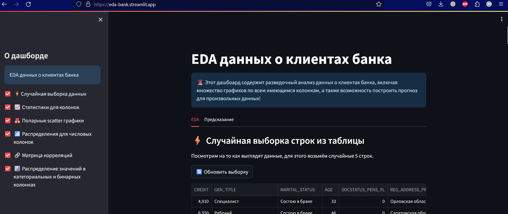
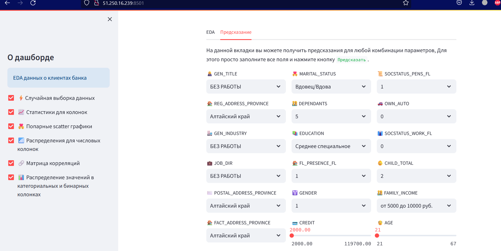

# Дашборд для данных о клиентах банка

Репозиторий содержит:
- [ноутбук](notebooks/prepare_data.ipynb) с подготовкой данных и обучением модели;
- streamlit [приложение](streamlit_eda/app.py) с EDA и возможностью прогнозирования.

Развёрнутое приложение доступно по адресу [https://eda-bank.streamlit.app/](https://eda-bank.streamlit.app/).

### Разработка

Для запуска приложения локально установите poetry, затем выполните:

```bash
poetry install
```

Для запуска приложения воспользуйтесь командой
```bash
poetry run 
```

### Примеры



